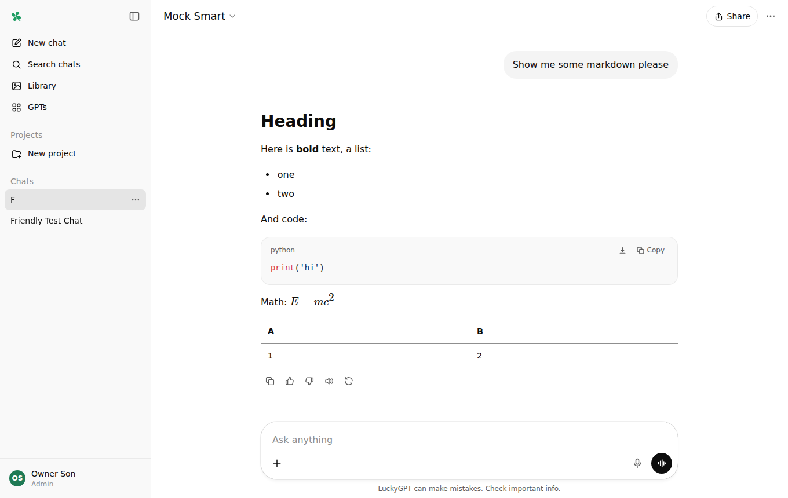
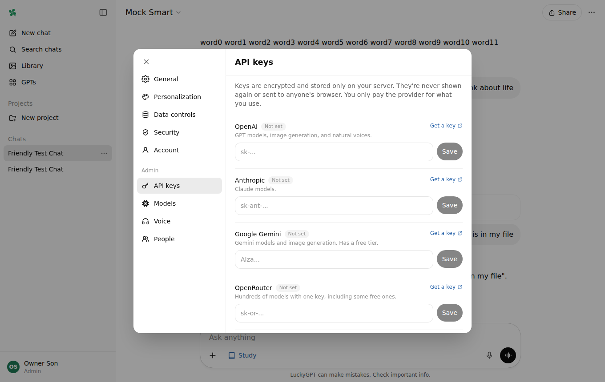
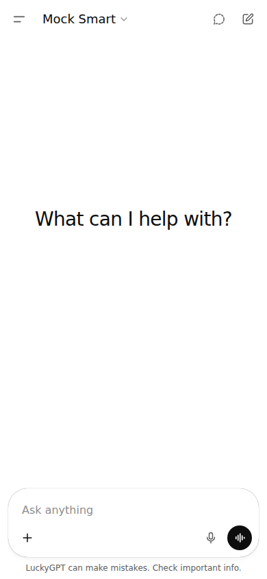

# 🍀 LuckyGPT

A private ChatGPT look-alike you host yourself. It looks and works like ChatGPT, so anyone who's used ChatGPT already knows how to use it. The one difference: **you pick the AI models** (OpenAI GPT, Anthropic Claude, Google Gemini, OpenRouter's hundreds of models, or your own local ones), using your own API keys.

The app is free. You only pay the AI provider for what you actually use, usually a few cents a day, and some providers have free options (see [What it costs](#what-it-costs)).

| Chat | Settings → API keys | Phone |
| --- | --- | --- |
|  |  |  |

---

## Everything ChatGPT has

- **Chat**: streaming answers, Markdown, code blocks with Copy/Download, math, tables, **Stop**, **Regenerate** (optionally with a different model), **Edit your message**, and browsing versions with `< 1/2 >`.
- **Sidebar**: New chat, Search chats (<kbd>Ctrl/⌘</kbd>+<kbd>K</kbd>), Library, GPTs, Projects, pinned chats, and your chat history. Each chat has a **⋯** menu with Share, Rename, Pin, Move to project, Archive, and Delete. The sidebar collapses to an icon rail on desktop and becomes a slide-out drawer on phones.
- **Model picker** at the top, just like ChatGPT's. It groups models by provider, and you can "make default".
- **+ menu tools**: Add photos & files, Create image, Thinking, Deep research, Web search, Canvas, and Study and learn.
- **Thinking**: shows "Thinking…" and then "Thought for 12s", which you can expand to read the reasoning (for models that think).
- **Web search** with a **Sources** list. It uses each provider's own search: OpenAI, Claude, Gemini (Google Search), and OpenRouter.
- **Image generation** (OpenAI gpt-image, Gemini "Nano Banana", or OpenRouter). Just ask "draw me…", or edit a photo you uploaded.
- **Files & photos**: images, PDFs, Word documents, and text/code files. Drag and drop or paste works too. Text-only models can still "see" photos: pick an **Image understanding** model in Settings → Models (any OpenRouter vision model works) and it describes each photo to the chat model.
- **Reliable answers**: if a provider hiccups ("upstream" errors, overloads, empty replies), LuckyGPT quietly retries up to 3 times before showing an error.
- **Usage bar**: tap your name to see OpenRouter spending against your credits or key limit, plus messages sent today out of 1000 (OpenRouter's daily free-model limit).
- **Voice**:
  - 🎤 **Dictate** in the composer.
  - 🔊 **Read aloud** on any answer.
  - 🌀 **Voice mode**: a full-screen orb conversation that listens, thinks, and talks back, and you can interrupt it by talking.
- **Memory**: LuckyGPT remembers useful things you tell it. You can see and delete memories in Settings → Personalization.
- **Custom instructions & personality** (Default, Cynic, Robot, Listener, Nerd), plus theme (System/Light/Dark) and accent color.
- **Temporary chat**: not saved, and doesn't use or change memory.
- **Projects**: folders of chats with their own instructions and files.
- **GPTs**: build your own custom assistants with instructions, conversation starters, knowledge files, and a recommended model. Templates are included.
- **Canvas**: a side panel where you and the AI write documents or code together.
- **Share** a read-only public link to a chat, and manage or delete your links later.
- **Data controls**: archive, archive all, delete all, and **export all your data**.
- **Security**: 2-step login (authenticator app + recovery codes), change password, see your devices, and log out one device or all of them.
- **Multiple people**: each family member gets their own private account. **Admins can't read other people's chats.**
- **iPhone app**: open the site in Safari, then **Share → Add to Home Screen**. It runs full-screen like an app: safe areas and the keyboard are handled, you can swipe from the left edge to open the sidebar, and voice plays after a tap. For voice mode in the home-screen app, set Speech to text to a server provider (OpenRouter, OpenAI or Groq), because the iPhone doesn't allow its built-in recognition there.

---

## What it costs

| Thing | Cost |
| --- | --- |
| LuckyGPT itself | Free, forever |
| Hosting on Vercel (Hobby) + a Neon database | Free for personal use |
| AI usage | Pay-as-you-go, billed by each provider (typically cents per day for one person) |

**Want $0 AI usage?** A few options:

- **Google Gemini** has a free tier (daily limits). ⚠️ Google may use free-tier conversations to improve its products, so for private stuff consider a paid key.
- **OpenRouter** has some free models (their names end in `:free`).
- **Groq** has a free tier that's great for fast speech-to-text in voice mode.
- The **Browser** voice options are free. They use your browser's built-in voices.

Tip: set a monthly spending limit on each provider's billing page so there are never surprises.

---

## Put it online for free (about 15 minutes)

You'll end up with a link like `https://luckygpt-yourname.vercel.app` that your dad can open on any computer or phone and log in.

### 1. Make two secrets

- **APP_SECRET**: a long random password that encrypts everything. Make one at <https://1password.com/password-generator> (choose 48+ characters), or run `npm run secret` if you have Node installed. **Save it in your password manager. Never lose it or change it**, because it's needed to read everything that's stored.
- **SETUP_CODE**: any code you make up (for example `lucky-clover-2026`). You'll type it once to create your owner account, so nobody else can claim your site first.

### 2. Deploy on Vercel

1. Sign up at <https://vercel.com> with your GitHub account (the free **Hobby** plan).
2. Click **Add New… → Project**, find **LuckyGPT**, and click **Import**.
3. Open **Environment Variables** and add `APP_SECRET` and `SETUP_CODE` with the values from step 1.
4. Click **Deploy**. It takes about a minute.

### 3. Add the free database

1. In your Vercel project, open the **Storage** tab, then **Create Database → Neon (Serverless Postgres)** on the free plan.
2. Connect it to your project (all environments). This adds `DATABASE_URL` automatically.
3. Go to **Deployments**, click **⋯** on the latest one, and choose **Redeploy**.

### 4. First login

1. Open your site. You'll see **Set up LuckyGPT**.
2. Enter your **SETUP_CODE**, your name, a username, and a strong password.
3. Go to **Settings → Security** and turn on **Multi-factor authentication** (recommended).

### 5. Add AI models

1. Go to **Settings → API keys** and paste a key from any provider:
   - OpenAI: <https://platform.openai.com/api-keys>
   - Anthropic (Claude): <https://console.anthropic.com/settings/keys>
   - Google Gemini: <https://aistudio.google.com/apikey>
   - OpenRouter: <https://openrouter.ai/keys>
2. A few good models are added automatically. Change them in **Settings → Models**: **Add models** browses everything your key can use, and **Test** checks that a model works.
3. Optional: in **Settings → Voice**, pick the speech-to-text and text-to-speech providers (OpenAI, Google, Groq, OpenRouter, or ElevenLabs) and a small, fast model for voice chats. With OpenRouter you can do both with one key, for example `openai/gpt-4o-mini-transcribe` to listen and `google/gemini-3.1-flash-tts-preview` to talk.
4. Optional: add a second OpenRouter key under **OpenRouter — chat only**. Chat then bills to that key, while voice and images keep using the main OpenRouter key.

### 6. Give your dad an account

1. Go to **Settings → People → Add a person**, and click **Generate** for a password.
2. Send him the link, username, and password (a text or a note is fine). He can change the password in **Settings → Security**.
3. On his phone: open the link in Safari or Chrome, then **Share → Add to Home Screen**. Now it opens like an app.

If he ever forgets his password, you can reset it in **Settings → People**.

> Optional: in Vercel you can add your own domain under **Settings → Domains**.

---

## How your data is kept safe

- **API keys are never in the code.** They're stored only in your database, encrypted with AES-256-GCM using a key derived from `APP_SECRET`. The browser only ever sees `••••1234`.
- **Chats, titles, memories, custom instructions, files, projects, and GPTs are encrypted at rest** too. Someone who gets a copy of the database can't read any of it.
- **Passwords** are hashed with scrypt. Logins are rate-limited: 6 wrong tries locks that device out of that account for 15 minutes, with looser account-wide and device-wide limits.
- **Optional 2-step login** with any authenticator app. Codes can't be reused, and recovery codes work only once.
- **Sessions** use random tokens stored as hashes, in `HttpOnly`, `Secure`, `SameSite` cookies. They expire after 30 days without use. You can see your devices and log them out.
- **Protection against common web attacks**: a strict Content-Security-Policy with per-request nonces, CSRF checks (same origin plus a required header), clickjacking protection, `nosniff`, no referrers, and HSTS.
- **The AI can't leak your chat through images**: model-written image links are never auto-loaded, so a malicious web page can't trick it into sending data to a tracker.
- **Each person's data is separate.** Every request checks ownership, and admins manage keys and accounts but can't open other people's chats.
- **OpenAI requests use `store: false`**, and no provider trains on API data by default (except free tiers like Gemini's, see above).
- **Search engines are blocked** (`robots.txt` and `noindex`).

What you still need to do: keep `APP_SECRET` private and backed up, use strong passwords, and turn on 2-step login. The code contains no secrets, so the GitHub repo can be public or private.

---

## Other ways to run it

### On your own computer (for trying it out)

```bash
npm install
npm run dev
```

Open <http://localhost:3000>. No database is needed: it uses a built-in Postgres (PGlite) stored in `./data`.

### Docker (home server, Raspberry Pi, any VPS)

```bash
cp .env.example .env   # fill in APP_SECRET and SETUP_CODE
docker compose up -d
```

Data is kept in the `luckygpt-data` volume. Microphones and voice mode only work over **https** (or on localhost). For access from outside your home, put it behind something like [Cloudflare Tunnel](https://developers.cloudflare.com/cloudflare-one/connections/connect-networks/) or [Caddy](https://caddyserver.com/), both free.

### Local models (Ollama, LM Studio)

Add them in **Settings → API keys → Custom endpoints**, for example `http://localhost:11434/v1` for Ollama. This only works when LuckyGPT runs on the same machine or network as the model, so it won't work from a Vercel-hosted site.

---

## Troubleshooting

| Problem | Fix |
| --- | --- |
| "No database connected" | Do step 3 (add Neon), then redeploy. |
| "APP_SECRET … is missing" | Add it under Vercel → Settings → Environment Variables, then redeploy. |
| Setup page says the code is wrong | Check the `SETUP_CODE` environment variable, and redeploy after changing it. |
| "The API key was rejected" | Paste the key again in Settings → API keys, and check billing is set up with that provider. |
| "Model ID wasn't found" | Fix or remove the model in Settings → Models. Use **Add models** to pick from the real list. |
| Voice mode can't hear you / dictation fails | Allow the microphone in the browser. The free "Browser" speech-to-text only works in Chrome, Edge and Safari (not Brave, Firefox or the iPhone home-screen app), so pick OpenRouter, OpenAI or Groq under Settings → Voice → Speech to text. |
| Voice replies are silent or robotic | The server voice failed, and LuckyGPT fell back to the browser's voice. The red message says why (for example, a wrong model or voice ID). |
| File won't upload | Files must be 4 MB or smaller. Photos are shrunk automatically. |

---

## For developers

- Next.js 16 (App Router) + React 19 + Tailwind CSS 4, with the [Vercel AI SDK](https://ai-sdk.dev) for all providers.
- `src/lib/server`: database (Postgres or PGlite), encryption, auth, providers, and the chat engine (`engine.ts`).
- `src/app/api`: all API routes. Every route goes through `handler()` in `http.ts`, which does auth, CSRF checks, and error handling.
- `src/components`: the ChatGPT-style interface. `AppShell.tsx` routes between the screens.
- `npm run typecheck`, `npm run lint`, and `npm run build` should all pass before you push.
